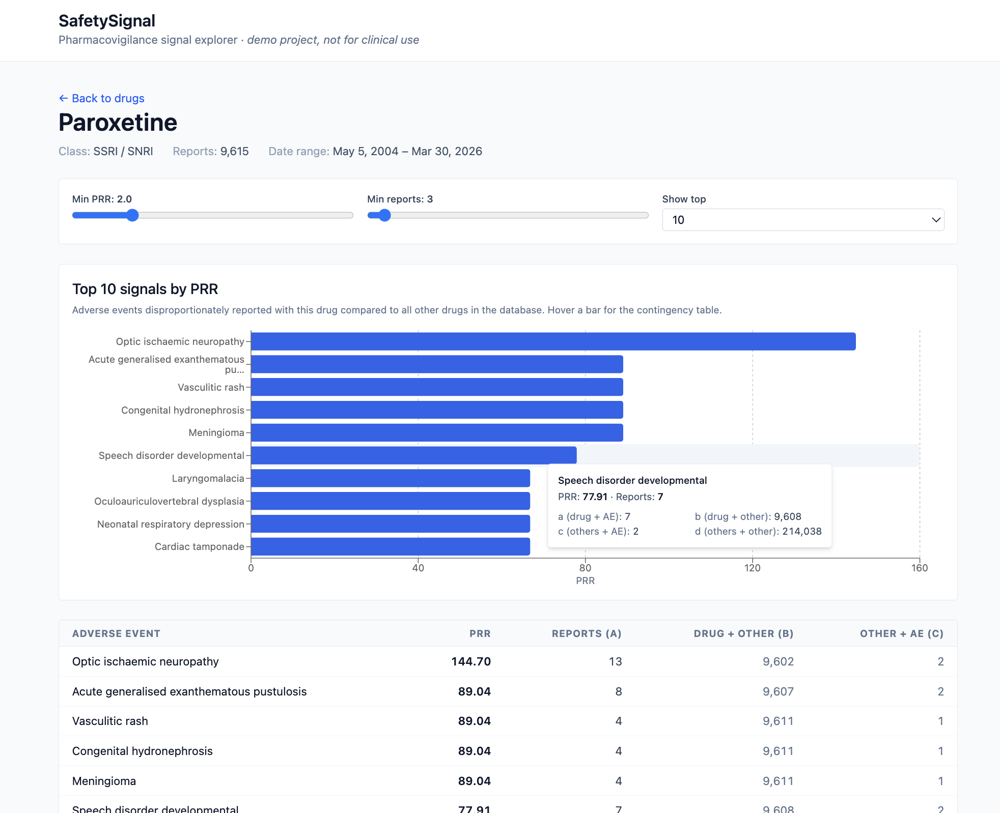
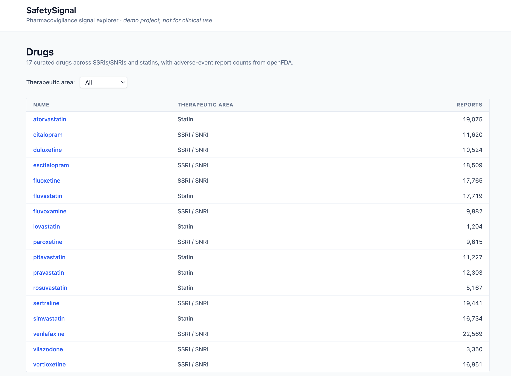

# SafetySignal

[](https://github.com/liferg/safetysignal/actions/workflows/ci.yml)

A pharmacovigilance signal explorer that ingests FDA adverse event reports for a curated set of drugs from the openFDA API, computes Proportional Reporting Ratio (PRR) statistics per (drug, AE) pair, and surfaces the strongest signals via a typed REST API and a React dashboard.

> **Demo / portfolio project. Not for clinical use.**
> This is intended to demonstrate full-stack engineering against a real biomedical dataset and methodology. Signals surfaced here are not clinically validated and should not be used for any medical decision-making.

## Screenshots

**Drug detail page** — top PRR-ranked safety signals for a drug, with adjustable thresholds and a horizontal bar chart. Hovering a bar reveals the full 2×2 contingency table behind the PRR.




**Drugs list** — the 17 curated drugs across SSRIs/SNRIs and statins, with total report counts. Filterable by therapeutic area.



## The science, briefly

When patients or clinicians report adverse events (AEs) while on a drug, regulators want to know: *which of these events are likely associated with the drug, vs. just background noise?*

**Proportional Reporting Ratio (PRR)** is the standard pharmacovigilance method for surfacing this signal. For each (drug, AE) pair, it computes a 2×2 contingency table from the report database and asks: *how much more often does this AE appear with this drug than it does across all other drugs?*

```
                | this AE  | other AEs
----------------+----------+----------
this drug       |    a     |    b
other drugs     |    c     |    d

PRR = (a / (a+b)) / (c / (c+d))
```

By WHO-UMC convention, a PRR ≥ 2 with at least 3 supporting reports is flagged as a **signal worth investigating**. (Signals are correlative, not causal. They prioritize where regulators look, not what they conclude.)

This project implements PRR exactly per that convention against ~225,000 FAERS reports for 17 drugs across two therapeutic areas (SSRIs/SNRIs and statins). The frontend lets you slide PRR/count thresholds and see signals re-rank in real time.

## Architecture

```
                       ┌─────────────────┐
                       │     Browser     │
                       └────────┬────────┘
                                │  localhost:5173
                                ▼
   ┌──────────────────────────────────────────────────────────┐
   │  React + Vite       (frontend container, port 5173)      │
   │  • DrugsList  • DrugDetail (Recharts horizontal bar)     │
   │  • TanStack Query  • openapi-fetch (typed via schema.ts) │
   └──────────────────────┬───────────────────────────────────┘
                          │  /api/*  (Vite proxy to backend)
                          ▼
   ┌──────────────────────────────────────────────────────────┐
   │  FastAPI            (backend container, port 8000)       │
   │  Six endpoints + auto-generated /openapi.json /docs      │
   │  stats.compute_signals() — PRR SQL CTE                   │
   └──────────────────────┬───────────────────────────────────┘
                          │  SQLAlchemy 2.0 + psycopg
                          ▼
   ┌──────────────────────────────────────────────────────────┐
   │  PostgreSQL 16      (postgres container, port 5432)      │
   │  drugs · adverse_events · reports                        │
   └──────────────────────▲───────────────────────────────────┘
                          │  one-shot, idempotent
                          │
   ┌──────────────────────┴───────────────────────────────────┐
   │  ingest.py     →    openFDA API   (api.fda.gov)          │
   │  Paginates per drug, cartesian-products suspect drugs ×  │
   │  reactions, bulk-INSERTs with ON CONFLICT DO NOTHING.    │
   └──────────────────────────────────────────────────────────┘
```

**End-to-end type safety pipeline:**
Pydantic models → FastAPI's `/openapi.json` → `openapi-typescript` codegen → `frontend/src/api/schema.ts` → `openapi-fetch`-typed React calls. A backend API change that breaks the frontend produces a TypeScript compile error rather than a runtime bug.

## Tech stack

| Layer | Technology |
|---|---|
| Backend language | Python 3.12 |
| Web framework | FastAPI (Pydantic v2, auto-OpenAPI) |
| ORM + migrations | SQLAlchemy 2.0 + Alembic |
| Database | PostgreSQL 16 |
| HTTP client (backend) | httpx |
| Frontend framework | React 19 + TypeScript 5 + Vite 8 |
| Styling | Tailwind v4 |
| Data fetching | TanStack Query v5 |
| Routing | React Router v7 |
| Charts | Recharts v3 |
| Typed API client | openapi-fetch + openapi-typescript |
| Containerization | Docker Compose (postgres + backend + frontend) |
| Testing | pytest (14 tests) |
| Linting | ruff (backend) + ESLint (frontend) |
| CI | GitHub Actions (parallel backend + frontend jobs) |

## Run locally

Requires [Docker Desktop](https://www.docker.com/products/docker-desktop/).

```bash
docker compose up --build
```

The first build takes a few minutes (pulls Postgres, builds the backend image, installs frontend deps). Subsequent runs are fast.

When all services are ready:

- **Frontend**: http://localhost:5173
- **API docs**: http://localhost:8000/docs (interactive Swagger UI)
- **Raw OpenAPI**: http://localhost:8000/openapi.json
- **Health check**: http://localhost:8000/health

### Populating the database

The fresh database has the schema but no data. To ingest the curated FAERS reports:

```bash
# (Optional but recommended) Get a free openFDA API key from
# https://open.fda.gov/apis/authentication/ to raise daily limits.
export OPENFDA_API_KEY=your_key_here
docker compose up -d   # picks up the env var

# Run the ingestion (~20–35 minutes for all 17 drugs)
docker compose exec backend python -m safetysignal.ingest
```

The ingest is idempotent, so it's safe to re-run. Previously-inserted rows are silently skipped via `ON CONFLICT DO NOTHING`.

## Tests

```bash
docker compose exec backend pytest -v
```

14 tests covering:

- **The critical PRR test** (`tests/test_stats.py`) — verifies PRR computation against a hand-worked 2×2 contingency table. If this passes, every signal the API serves is mathematically sound.
- Filter behavior (`min_count`, `min_prr`).
- Full API contract tests via FastAPI's `TestClient` — every endpoint, including 404 + 422 paths and full nested response shapes.

Test isolation: a separate `safetysignal_test` database is created per session; each test runs in a transaction that rolls back, so no test data persists.

## Project structure

```
safetysignal/
├── docker-compose.yml          postgres + backend + frontend
├── .github/workflows/ci.yml    GitHub Actions: pytest + ruff + ESLint + build
│
├── backend/
│   ├── Dockerfile
│   ├── pyproject.toml          deps + ruff/pytest config
│   ├── alembic/                migrations (initial schema)
│   ├── safetysignal/
│   │   ├── main.py             FastAPI app + CORS + router registration
│   │   ├── config.py           settings via pydantic-settings
│   │   ├── db.py               SQLAlchemy engine + Base
│   │   ├── deps.py             FastAPI dependency injection (get_db)
│   │   ├── models.py           Drug, AdverseEvent, Report (ORM)
│   │   ├── schemas.py          Pydantic response models
│   │   ├── stats.py            PRR computation (the CTE SQL)
│   │   ├── drugs.py            the 17 curated drugs (single source of truth)
│   │   ├── preflight.py        diagnostic script for openFDA report counts
│   │   ├── ingest.py           one-shot FAERS ingestion
│   │   └── api/                router modules: drugs, signals, adverse_events
│   └── tests/                  pytest tests + DB/client fixtures
│
└── frontend/
    ├── package.json            deps + gen:api script
    ├── vite.config.ts          Tailwind plugin + dev proxy to backend
    └── src/
        ├── App.tsx             routes
        ├── main.tsx            QueryClientProvider + BrowserRouter
        ├── api/
        │   ├── client.ts       typed openapi-fetch client (baseUrl: /api)
        │   └── schema.ts       generated from /openapi.json
        └── pages/
            ├── DrugsList.tsx   filterable drug table
            └── DrugDetail.tsx  metadata + filter sliders + Recharts chart
```

## Known limitations

- **MedDRA SOC (System Organ Class) is always null.** openFDA's adverse-event records expose the Preferred Term (`reactionmeddrapt`) but not the SOC mapping. Backfilling from a public MedDRA hierarchy is a deliberate future-phase item; the column was kept nullable from day one for this reason.
- **PRR is unstable for sparse cohorts.** With only 17 drugs in the database, AEs that are rare in the broader FAERS population can produce extreme PRRs. The threshold sliders on the UI are the right surface for analysts to tune through this; a real pharmacovigilance system running against the full FAERS dataset (millions of reports across thousands of drugs) would dampen this effect.
- **Frequentist disproportionality only.** No Bayesian methods (EBGM, MGPS), no confidence intervals, no time-windowed analysis. These would be natural next-phase additions.
- **No authentication, no authorization, no rate limiting.** Single-tenant demo. Public deployment would need at least the API key check, request rate limiting, and probably basic auth on the dashboard.

## Ideas for future iterations

- SOC backfill from a public MedDRA hierarchy → enables organ-system color-coding on the chart.
- More drug classes (NSAIDs, antibiotics, chemotherapy) → richer cross-class comparisons.
- Bayesian methods (EBGM, MGPS) → more stable signals on sparse data.
- Time-windowed PRR → detect when signals emerge or fade.
- Public deployment via Fly.io or Render free tier.

## References

- openFDA `/drug/event` API — https://open.fda.gov/apis/drug/event/
- van Puijenbroek EP et al., "A comparison of measures of disproportionality for signal detection in spontaneous reporting systems for adverse drug reactions," *Pharmacoepidemiology and Drug Safety*, 2002.
- Evans SJ, Waller PC, Davis S, "Use of proportional reporting ratios (PRRs) for signal generation from spontaneous adverse drug reaction reports," *Pharmacoepidemiology and Drug Safety*, 2001.
- WHO-UMC signal detection — https://www.who-umc.org/
